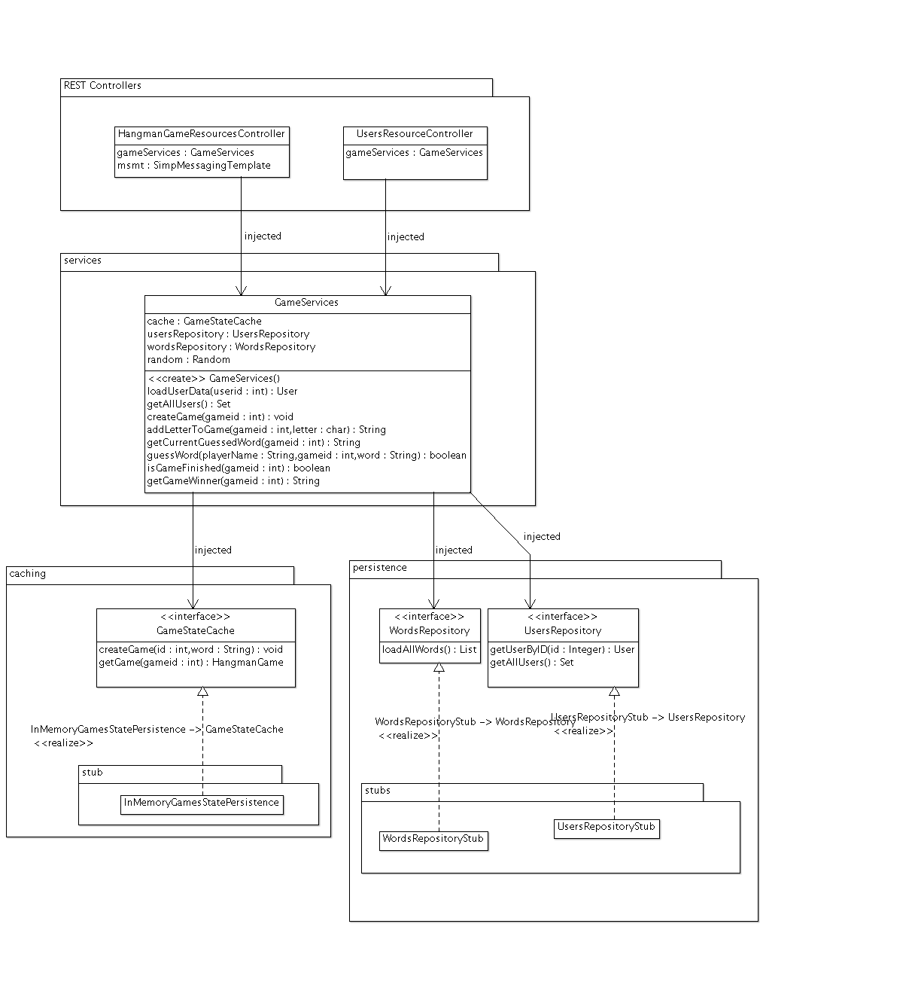
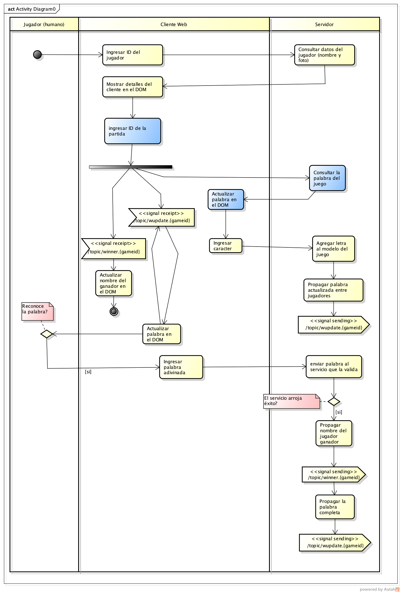

#### Escuela Colombiana de Ingeniería
#### Arquitecturas de Software - ARSW
#### Parcial Segundo Tercio 


**IMPORTANTE**
* Se puede consultar en la Web: APIs/Documentación de lenguaje y frameworls (Spring, HTML5, JS, etc), y enunciados de los laboratorios (se pueden revisar los fuentes incluidos con los dichos enunciados).
* No se permite: Usar memorias USB, acceder a redes sociales, clientes de correo, o sistemas de almacenamiento en la nube (Google Drive, DropBox, etc). El uso de éstos implicará anulación.
* Clone el proyecto con GIT, NO lo descargue directamente.
* NO modifique los identificadores de los componentes HTML, las etiquetas de los botones existentes, o la estructura de paquetes, ya que puede le afectar el resultado del proceso _batch_ de evaluación.


## Ahorcado  multijugador

Este repositorio tiene una versión incompleta de una variante del popular juego "ahorcado". Esta versión difiere del orignal en cuanto que:

* Una partida se puede realizar simultáneamente entre varios jugadores, y el sistema permite realizar varias partidas simultáneamente. Es decir, una vez asociados a una partida, todos los jugadores pueden solicitar 'descubrir' si la palabra tiene una determinada letra, e intentar adivinar la palabra. Por ejemplo, es posible que inmediatamente después de que un jugador acierte con una letra faltante, el otro adivine la palabra.
* Por ahora, el juego no se pierde al alcanzar un número máximo de intentos, sino sencillamente gana el primero que adivine la palabra.
* Por ahora, no se tendrá la funcionalidad de 'creación de partidas', por lo que se deberá jugar en alguna de las partidas ya existentes.
* El hecho de que un jugador adivine la última palabra faltante en la palabra NO SIGNFICA QUE YA HAYA GANADO. En ese caso, las reglas son las mismas, y sólo puede ganar el que escriba y envíe más rápidamente la palabra completa (de nuevo, así la misma ya haya sido descubierta).

En la versión actual, ya se tiene implementado:

* Parte del controlador del API REST para el manejo de las partidas, las cuales sólo existirán temporalmente.

* Parte del controlador del API REST para el manejo de los jugadores, que en este caso sí son persistentes.

* La capa lógica usada por dichos controladores, a la cual, a su vez, se le inyectará un 'caché', para guardar temporalmente los datos volátiles (es decir, todas las partidas), y unos 'repositorios' (algo similar a un DAO) para manejar los datos persistentes (en este caso, los jugadores y las palabras). Puede ver las operaciones disponibles revisando la documentación de la clase GameServices. 



Por otro lado, tenga en cuenta:

* En el STUB de persistencia (repositorio) provisto, e inyectado a la lógica, se cuenta con los usuarios identificados con 112233, 223344, 334455.

* En el STUB del caché de las partidas, se tienen ya creadas las partidas con los identificadores 1, 2, 3 y 4.

Dado lo anterior:

1. Complete la funcionalidad del juego, siguiendo como especificación el siguiente diagrama de actividades. Tenga en cuenta que lo que está en azul ya está implementado (por ahora el juego permite cargar la palabra sin antes haber consultado el jugador). De dicho diagrama inferir qué estilos arquitectónicos se deben considerar en cada caso:

	


* Nota 1: las cadenas "/topic/winner.{gameid}" y "/topic/wupdate.{gameid}" indican que {gameid} será un valor variable dentro de los nombres de los tópicos, y coresponderá al identificador del juego en curso. Por ejemplo: "/topic/winner.2",  "/topic/winner.43", etc.
	

* Criterios de evaluación:
	1. [10%] Corresponencia entre el diagrama de actividades y la implmentación, Nivel de madurez (Richardson) de los recursos REST adicionados.
	2. [20%] El juego consulta correctamente los detalles del cliente.
	3. [40%] El juego permite UNA partida colaborativa.
	4. [30%] El juego permite VARIAS partidas colaborativas, sin que unas interfieran con las otras.

## Entrega

Siga al pie de la letra estas indicaciones para la entrega del examen. EL HACER CASO OMISO DE ESTAS INSTRUCCIONES PENALIZARÁ LA NOTA.

1. Limpie el proyecto

	```bash
	$ mvn clean
	```

1. Configure su usuario de GIT

	```bash
	$ git config --global user.name "Juan Perez"
	$ git config --global user.email juan.perez@escuelaing.edu.co
	```

2. Desde el directorio raíz (donde está este archivo README.md), haga commit de lo realizado.

	```bash
	$ git add .
	$ git commit -m "entrega parcial - Juan Perez"
	```


3. Desde este mismo directorio, comprima todo con: (no olvide el punto al final en la segunda instrucción)

	```bash
	$ zip -r APELLIDO.NOMBRE.zip .
	```

4. Abra el archivo ZIP creado, y rectifique que contenga lo desarrollado.

5. Suba el archivo antes creado (APELLIDO.NOMBRE.zip) en el espacio de moodle correspondiente.

6. IMPORTANTE!. Conserve una copia de la carpeta y del archivo .ZIP.
